## 一、什么是Fiddler？
<font color="red">Fiddler </font>是一个强大的HTTP调试抓包工具。Fiddler官方版可以用其检测网页和服务器的交互情况，Fiddler能够记录所有客户端和服务器间的http请求，支持监视、设置断点、甚至修改输入输出数据等功能。Fiddler对开发人员或者测试人员来说，都是非常有用的工具。
## 二、下载安装Fiddler

Fiddler官网下载地址：[打开下载地址](https://www.telerik.com/download/fiddler)



一路next，当见到浏览器打开以下页面时，及安装成功


## 三、如何配置Fiddler？
### 1、打开Fiddler

安装完成后，打开软件(在安装目录下找到Fiddler.exe文件，双击打开)


### 2、配置Fiddler

打开后我们可以看到Fiddler的一个面板，随后打开tools > options 菜单

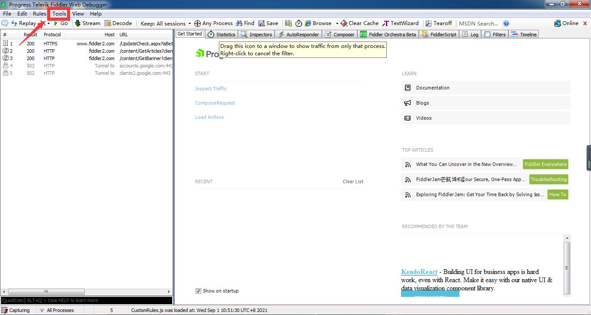

在options菜单中，我们打开https模块，然后勾选Decrypt HTTPS traffic



随后软件出现以下弹窗，我们选yes

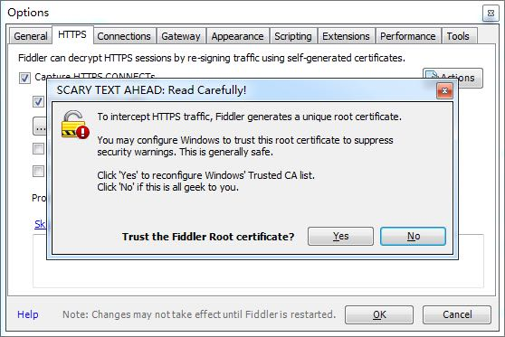

在上一步后，系统将提示是否安装证书，我们选是就行了

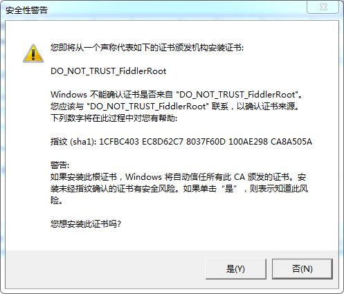

接着勾选上Ignore server certificate errors即可，返回主面板然后打开浏览器，现在我们就可以看到左侧面板中有抓到的包数据进来了

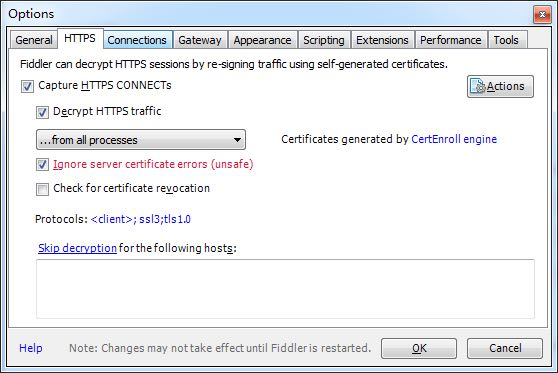

在左侧面板中，我们可以看到数据包的状态码、host、url等

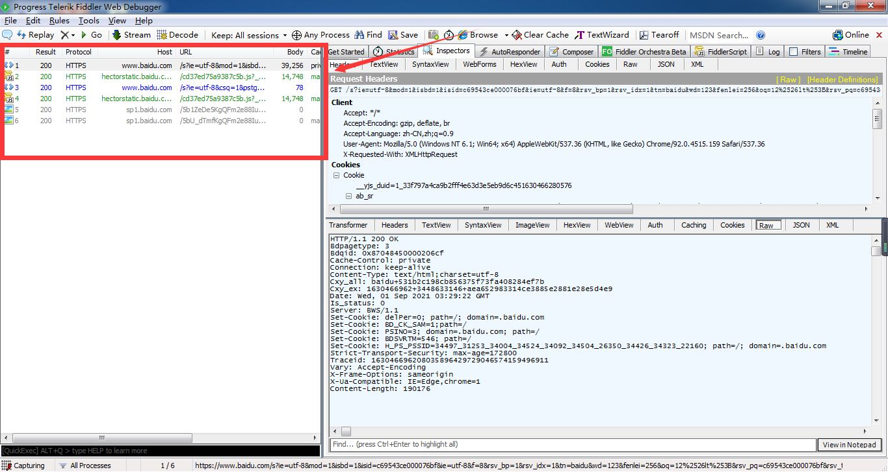

在左侧面板中选中一个数据包，则可在右侧面板中查看到该请求的请求头以及具体返回值相关信息


#### 2.1、配置手机抓包

Fiddler中打开tools > options > connection 设置端口，并允许远程连接

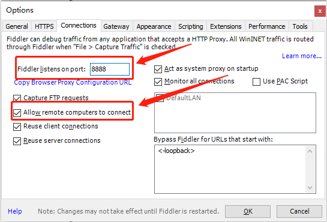

首先我们需要在Fiddler右上角获取当前ip地址，手机连接wifi必须与电脑连接的网络处于同一网段

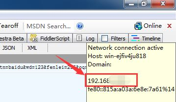

<font color="red">Android:</font>
打开手机中设置 > WIFI > 网络详情 > 代理(配置代理) > 手动 中输入刚刚我们的ip以及端口号保存

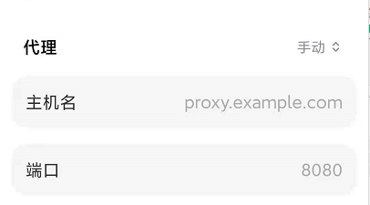

<font color="red">iOS:</font>
打开手机中设置 > WIFI > 网络详情 > 代理(配置代理) > 手动 中输入刚刚我们的ip以及端口号保存

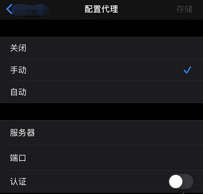

然后打开手机自带的浏览器，输入下面地址，然后点击<font color="red"> FiddlerRoot certificate </font>下载证书

```
IP地址:端口号 //注意冒号用英文冒号
```

<font color="red">Android </font>下载完成后，在下载中找到文件点击根据提示进行安装，至到系统提示安装完成
<font color="red">iOS </font>需注意下载完成之后，打开设置 > 通用 > 描述文件 进行安装，安装完成之后进入关于本机 > 证书信任中将<font color="Green"> DO_NOT_TRUST_FidderRoot </font>打开

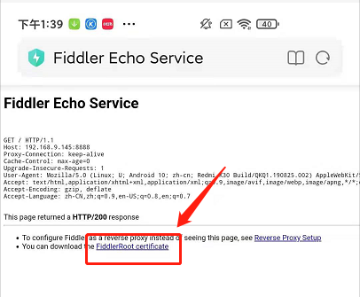

以上配置完成了之后就可以愉快的抓包啦~

## 四、如何使用Fiddler
#### 1、过滤器

在右侧面板中，打开 Filters ，勾选 use Filters ，然后与下图相同配置，在输入框中输入想要过滤出来的域名，如:baidu.com 多个域名之间使用英文分号隔开，设置完成后点击右侧Action中 Run Filterset Now 立即执行

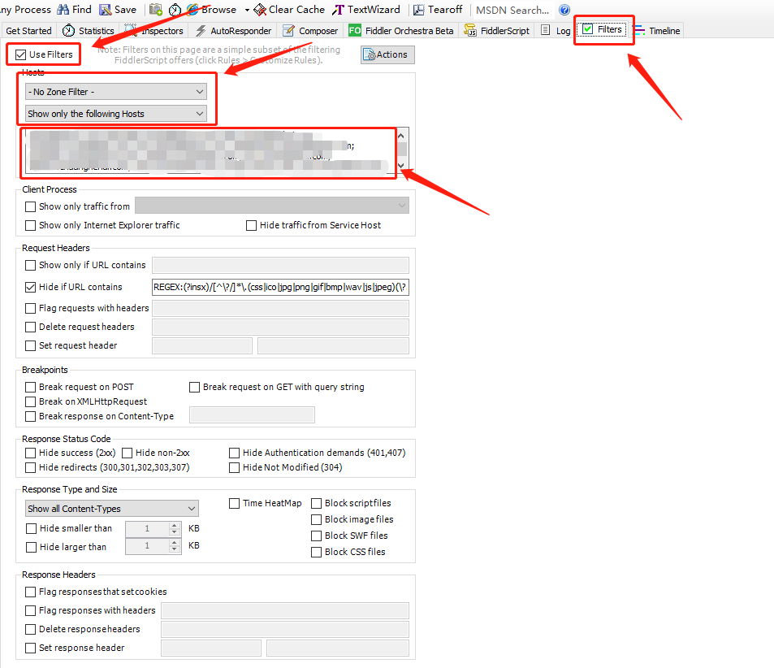
#### 2、断点

在顶部菜单中选择 Rules > Automatic BreakPoints，在这个菜单项我们可以看到有<font color="red">Before Requests 、 After Requests 、 Disabled </font>三个选项，默认选中Disables。
<font color="red">Before Requests </font>则为在请求之前拦截，选择了此项后，我们可以在请求之前修改请求头，修改完成后，点击Run to Completion即可发送请求，以达到测试效果
<font color="red">After Requests </font>则为在请求之后拦截，选择了此项后，我们可以在请求之后修改返回参数，修改完成后，点击Run to Completion即可发送请求，以达到测试效果

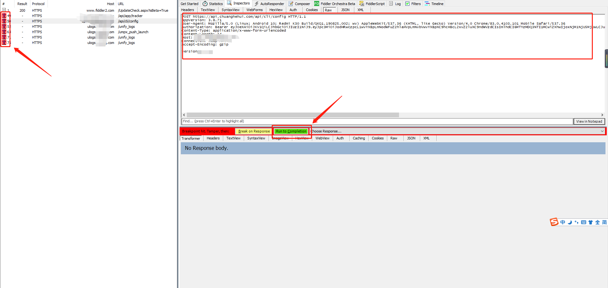
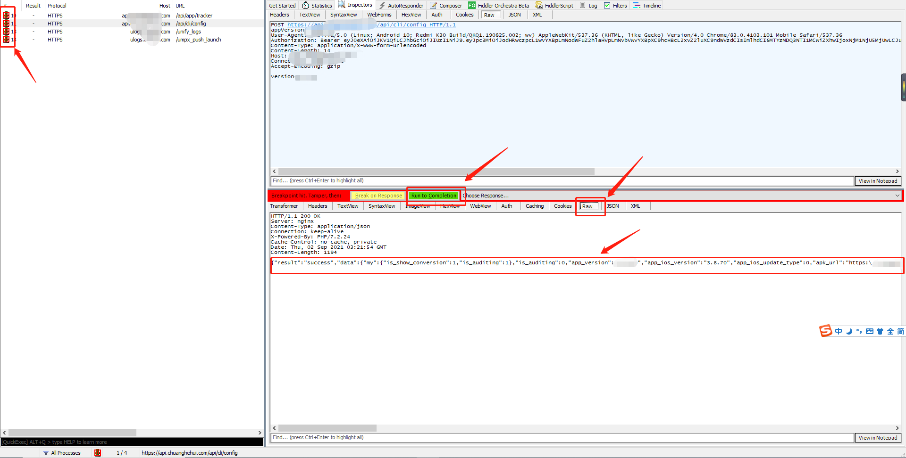
#### 3、弱网设置

在右侧面板中，打开 FiddlerScript，找到以下脚本进行更改。
<font color="red"> request-trickle-delay </font>中的值代表每KB的数据被上传时会被延时多少毫秒；
<font color="red"> response-trickle-delay </font>则对应下载时每KB的数据会被延时多少毫秒

```javascript
if (m_SimulateModem) {
    // Delay sends by 300ms per KB uploaded.
    oSession["request-trickle-delay"] = "300"; 
    // Delay receives by 150ms per KB downloaded.
    oSession["response-trickle-delay"] = "150"; 
}
```
### 五、小节

如果上述操作没有抓到包，建议尝试手动导入导出证书后再试。最后附上官方文档，如有其它功能需求可以[查看官方文档~](https://docs.telerik.com/fiddler/configure-fiddler/tasks/configurefiddler)

