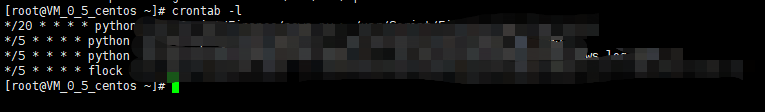

## 一、什么是Crontab？
<font color=red>cron</font> 是一个Linux定时执行工具，可以在无需人工干预的情况下运行作业。 在服务器中，<font color=red>cron</font> 是被默认安装并启动的。
## 二、为什么我们要使用Crontab？
在日常服务器项目运行过程中，我们避免不了的需要在固定的时间去执行固定的任务。如果每次都需要手动执行程序去完成任务，那实在是太累了，此时就可以用到crontab来代替我们人工去触发执行这些任务。
## 三、如何使用Crontab？
### 1. 查看Crontab的工作表
``` bash
crontab -l
```

### 2. 编辑Crontab工作表
``` bash
crontab -e
```

进入编辑页之后，输入"a"进入编辑模式。编辑完成之后，ctrl+c保存，输入":"，再输入"wq"加回车退出编辑模式。

### 3. 删除Crontab工作表中的工作
``` bash
crontab -r
```
### 4. Crontab的命令构成
#### 4.1 数字范围
``` bash 
0-59 0-23 1-31 1-12 0-7 python main.py
```

分钟 小时 日期 月份 周 命令

#### 4.2 特殊字符
``` bash
"*"代表所有的取值范围内的数字，如月份字段为"*"，则表示1到12个月；

"/"代表每一定时间间隔的意思，如分钟字段为"*/10"，表示每10分钟执行1次。

"-"代表从某个区间范围，是闭区间。如"2-5"表示"2,3,4,5"，小时字段中0-23/2表示在0~23点范围内每2个小时执行一次。

","分散的数字（不一定连续），如1,2,3,4,7,9。
```
#### 4.3 日志存储

构建完上述命令后，可在命令后端加上">> 文件名.log"，存储日志

### 5. 示例
#### 5.1 每一分钟执行一次"mian.py"文件
``` bash
* * * * * python main.py
```

因为cron默认每一分钟扫描一次，故全部设置为"*"即可

#### 5.2 每小时的5和30分钟执行一次"mian.py"文件
``` bash
15,30 * * * * python main.py
```
#### 5.3 每天上午8~9点的5和30分钟执行一次"mian.py"文件
``` bash
15,30 8-9 * * * python main.py
```
#### 5.4 每隔三天上午8~9点的5和30分钟执行一次"mian.py"文件
``` bash
15,30 8-9 */3 * * python main.py
```
#### 5.5 每周三上午8~9点的5和30分钟执行一次"mian.py"文件
``` bash
15,30 8-9 * * 3 python main.py
```

