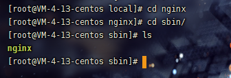

在拥有服务器后，需要将程序部署到服务器中，然后通过访问服务器地址加端口来展示网站，那就需要使用到nginx
## 一、下载
打开 [Nginx官方下载链接(后缀tgz)](http://nginx.org/download/) 进行下载，当前最新的1.9.9本，下载完成后一般将文件放置于 /usr/local/目录下

## 二、安装

### 1. 解压文件
使用以下命令进行解压，解压完成后可看到local目录下多了一个nginx-1.9.9的文件夹
```bash
tar zxvf nginx-1.9.9.tar.gz
```


### 2. 编译
解压完成后，进入解压后的文件夹内，使用configure命令检查安装环境
```bash
# –prefix指定nginx的安装目录，默认路径就是/usr/local/nginx
./configure --prefix=/usr/local/nginx --with-http_stub_status_module --with-http_ssl_module
```
以上操作完成后，输入以下命令进行编译
```bash
make
```
编译完成后，输入以下命令安装编译程序
```bash
make install
```
以上步骤全部完成后，进入 <font color="red">/usr/local/nginx/sbin</font> 目录下查看是否存在nginx，如果存在即安装成功


## 三、启动Nginx
### 1.启动
进入 <font color="red">/usr/local/nginx/sbin/</font> 目录下，输入以下命令即可
```bash
./nginx
```
### 2. 检查启动结果
在浏览器中输入ip地址，查看页面，如见到以下页面即安装成功(nginx默认监听的是80端口)


以上操作完成后，及安装成功

## 四、Nginx配置详解
打开 <font color="red">/usr/local/nginx/conf/nginx.conf</font> 文件进行编辑
```bash
#user  nobody;
worker_processes  1;# 工作进程：数目。根据硬件调整，通常等于cpu数量或者2倍cpu数量。

# 错误日志存放路径
#error_log  logs/error.log;
#error_log  logs/error.log  notice;
#error_log  logs/error.log  info;

# nginx进程pid存放路径
#pid        logs/nginx.pid;


events {
    worker_connections  1024;# 工作进程的最大连接数量
}


http {
    include       mime.types;# 指定mime类型，由mime.type来定义
    default_type  application/octet-stream;
# 日志格式设置
    #log_format  main  '$remote_addr - $remote_user [$time_local] "$request" '
    #                  '$status $body_bytes_sent "$http_referer" '
    #                  '"$http_user_agent" "$http_x_forwarded_for"';
    
    # 用log_format指令设置日志格式后，需要用access_log来指定日志文件存放路径
    #access_log  logs/access.log  main;

    # 指定nginx是否调用sendfile函数来输出文件，对于普通应用，必须设置on。
    # 如果用来进行下载等应用磁盘io重负载应用，可设着off，以平衡磁盘与网络io处理速度，降低系统uptime。
    sendfile        on;
    
    # 此选项允许或禁止使用socket的TCP_CORK的选项，此选项仅在sendfile的时候使用
    #tcp_nopush     on;
    
    # keepalive超时时间
    #keepalive_timeout  0;
    keepalive_timeout  65;
    
    # 开启gzip压缩服务
    #gzip  on;
    
    # 虚拟主机
    server {
        listen       80;# 配置监听端口号
        server_name  localhost;# 配置访问域名，域名可以有多个，用空格隔开
        
        # 字符集设置
        #charset koi8-r;

        #access_log  logs/host.access.log  main;

        location / {
            root   /usr/demo; # 项目路径
            index  login.html; # 需要访问的html文件名称
        }
        
        # 错误跳转页
        #error_page  404              /404.html;

        # redirect server error pages to the static page /50x.html
        #
        error_page   500 502 503 504  /50x.html;
        location = /50x.html {
            root   html;
        }

        # proxy the PHP scripts to Apache listening on 127.0.0.1:80
        #
        #location ~ \.php$ {
        #    proxy_pass   http://127.0.0.1;
        #}

        # pass the PHP scripts to FastCGI server listening on 127.0.0.1:9000
        #
        #location ~ \.php$ {
        #    root           html;
        #    fastcgi_pass   127.0.0.1:9000;
        #    fastcgi_index  index.php;
        #    fastcgi_param  SCRIPT_FILENAME  /scripts$fastcgi_script_name;
        #    include        fastcgi_params;
        #}

        # deny access to .htaccess files, if Apache's document root
        # concurs with nginx's one
        #
        #location ~ /\.ht {
        #    deny  all;
        #}
    }


    # another virtual host using mix of IP-, name-, and port-based configuration
    #
    #server {
    #    listen       8000;
    #    listen       somename:8080;
    #    server_name  somename  alias  another.alias;

    #    location / {
    #        root   html;
    #        index  index.html index.htm;
    #    }
    #}


    # HTTPS server
    #
    #server {
    #    listen       443 ssl;
    #    server_name  localhost;

    #    ssl_certificate      cert.pem;
    #    ssl_certificate_key  cert.key;

    #    ssl_session_cache    shared:SSL:1m;
    #    ssl_session_timeout  5m;

    #    ssl_ciphers  HIGH:!aNULL:!MD5;
    #    ssl_prefer_server_ciphers  on;

    #    location / {
    #        root   html;
    #        index  index.html index.htm;
    #    }
    #}

}
```

编辑完成后，重启Nginx即可生效

## 五、Nginx基础命令
```bash
./nginx # 启动nginx
./nginx -s stop # 先查出nginx进程id再使用kill命令强制杀掉进程
./nginx -s quit # 待nginx进程处理任务完毕进行停止
./nginx -s reload # 重启nginx
```

每次编辑完nginx.conf文件后都必须重启nginx

