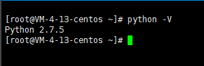
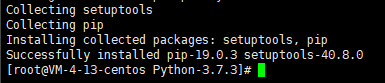
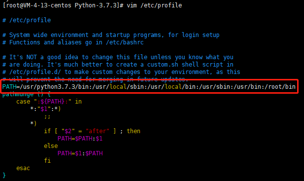
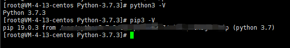

在Linux服务器中，一般都会自带python，版本为2.X，但是由于python不断迭代更新，我们用到的版本大多为3.X，故今天拿到一台新的服务器，准备在服务器中再安装一个python3.7.3版本。


尽量不要删除自带2.X的python，因为可能会有其他地方用到了，删掉了可能会导致其他问题难以解决。

## 一、下载安装包
本次安装的python版本为<font color=red> 3.7.3 </font>。首先，我们需要下载python 3.7.3版本的安装包
### 1、在Linux中通过<font color=red> wget </font>方式来下载：
#### 1.1、在Linux中新建一个存放安装包的文件夹
#### 1.2、然后进入该目录再使用<font color=red> wget </font>命令进行下载
```bash
wget https://www.python.org/ftp/python/3.7.3/Python-3.7.3.tgz
```
### 2、在Windows下打开 [python下载链接(后缀tgz)](https://www.python.org/ftp/python/) 来进行下载：

#### 2.1、下载完成后将安装包放入新建的文件夹中即可
## 二、安装
### 1、进入安装包所在目录，解压压缩包
```bash
tar -zxvf Python-3.7.3.tgz
```
### 2、解压完成后，进入源码文件夹中指定安装路径，之后如果想卸载此版本时，删除安装目录即可
### 3、进入安装路径后，需要指定安装目录，输入以下命令
```bash
./configure --prefix=/usr/python3.7.3
```
### 4. 完成指定后，进入安装目录下，进行编译
```bash
# 进入安装目录路径
cd python3.7.3
# 编译
make
```
### 5. 编译完成后，进行安装
```bash
make install
```


因为我使用的是<font color=red> centOS 7 </font>，在<font color=red> centOS </font>中直接使用<font color=red> make install </font>命令会报错<font color=red> No module named '_ctypes' </font>，解决方案：安装之前我们需要先使用命令<font color=blue> yum install libffi-devel -y </font>安装完成之后再进行安装python即可成功

### 6、配置系统环境变量
安装完python3后我们在随意目录下输入命令:
```bash
python -V
```
会发现，指向的依旧是2.X的版本，但我们希望可以直接使用的是python 3.7.3版本，所以需要将path添加到环境变量中去
修改/etc/profile系统环境变量配置文件，添加安装路径下的bin目录
```bash
# 使用vim命令，打开etc目录下的profile文件
vim /etc/profile
# 在文件首行输入以下内容
PATH=/usr/python3.7.3/bin:/usr/local/sbin:/usr/local/bin:/usr/sbin:/usr/bin:/root/bin
```

保存后，使用以下命令重载配置文件：
```bash
source /etc/profile
```
## 三、验证安装
输入以下命令进行验证：
```bash
python3 -V
pip3 -V
```


以上即安装全过程，全程顺畅无阻，完美安装~

