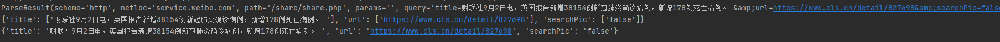

## python分解url中的参数
``` python
import urllib.parse as urlparse

url = 'http://service.weibo.com/share/share.php?title=财联社9月2日电，英国报告新增38154例新冠肺炎确诊病例，新增178例死亡病例。 &amp;url=https://www.cls.cn/detail/827698&amp;searchPic=false'

parsed = urlparse.urlparse(url)

print(parsed)

querys = urlparse.parse_qs(parsed.query)

print(querys)

querys = {k: v[0] for k, v in querys.items()}

print(querys)
```

