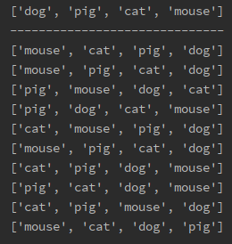

## 条件

假设已有一个list为['dog', 'pig', 'cat', 'mouse']，需求是将该列表随机打乱

## 解决方法

使用python随机函数random，调用random中的shuffle方法，将需要打乱的列表作为参数传递

```python
import random

demo_list = ['dog', 'pig', 'cat', 'mouse']

print(demo_list)
print('------------------------------')

# 循环打印十次看随机后的列表
for i in range(0, 10):
    random.shuffle(demo_list)
    print(demo_list)
```

