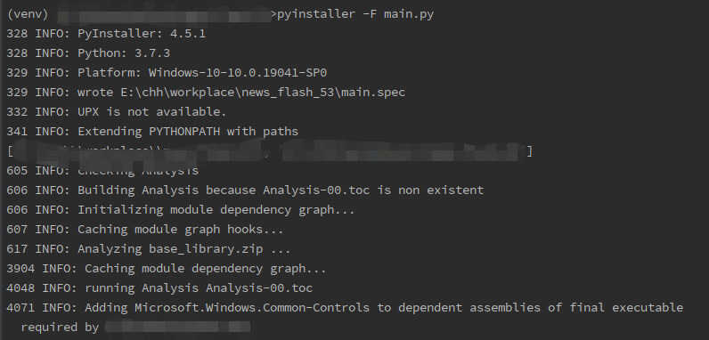

## 一、为什么要将项目打包
我们在日常开发中，在编辑器中完成了开发后，需要使得程序能够脱离编辑器独立运行，所有的第三方依赖、资源和代码均被打包进该exe内，那我们就需要将程序打包成exe可执行文件。打包可使用的工具有很多，这次主要做pyinstaller的示例。
## 二、安装pyinstaller
安装命令：
``` python
pip install pyinstaller
```
## 三、如何使用pyinstaller
### 1.功能注释
|      功能     |     注释     |
| ---------- | ---------- |
| -F     | 打包成一个文件      |
| pyinstaller -F main.py   | 将main.py打包，生成main.exe文件      |
| -D     | 打包成一个文件夹          |
| -n   | 重新命名      |
| pyinstaller -F main.py -n name   | 将main.py打包，生成main.exe文件      |
| -noconsole   | 去 掉cmd命令窗口      |
| -i   | 加入图标，图标所需要的是ico格式      |
| pyinstaller -i index.ico -F main.py   | 将main.py打包，生成main.exe文件，并给予index.ico作为图标      |
### 2.使用
在当前脚本所在位置打开cmd，输入命令
```bash
pyinstaller -F main.py
```

当看到以下输出即为打包成功
```bash
12781 INFO: Building EXE from EXE-00.toc completed successfully.
```
打包完成后，在当前文件夹下会生成一个dist及build文件夹，在dist文件夹下就可以看到刚刚我们打包所生成的exe文件，接下来双击即可运行
