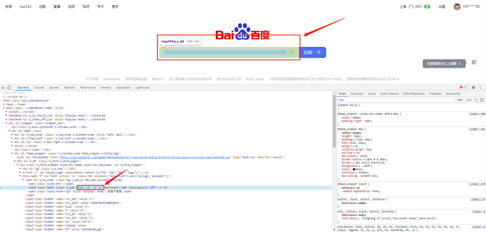

## 一、什么是Selenium？
<font color=red>Selenium</font>是一个用于Web应用程序测试的工具。Selenium测试直接运行在浏览器中，就像真正的用户在操作一样。支持的浏览器包括IE（7, 8, 9, 10, 11），Mozilla Firefox，Safari，Google Chrome，Opera，Edge等。这个工具的主要功能包括：测试与浏览器的兼容性——测试你的应用程序看是否能够很好得工作在不同浏览器和操作系统之上。测试系统功能——创建回归测试检验软件功能和用户需求。支持自动录制动作和自动生成 .Net、Java、Perl等不同语言的测试脚本。
## 二、安装Selenium
### 1. 下载python的selenium安装包
``` bash
pip install selenium
```
### 2. Windows下下载与浏览器版本相对应的webdriver
chrom浏览器的web driver
``` bash
http://npm.taobao.org/mirrors/chromedriver/
```
firefox（火狐浏览器）的web driver
``` bash
https://github.com/mozilla/geckodriver/releases
```
Safari的web driver
``` bash
https://webkit.org/blog/6900/webdriver-support-in-safari-10/
```

下载完成后，将解压出来的exe文件与py文件放置同一个目录下。

## 三、示例
### 1. 引入Selenium包，并调起浏览器

首先，引入需要用到的selenium包中的webdriver模块

``` python
from selenium import webdriver
```

使用webdriver模块中的方法，调起对应的浏览器

```python
from selenium import webdriver

# 调起谷歌浏览器，如对应驱动不在统一目录下，在括号中加入路径
driver = webdriver.Chrome()
# 调起火狐浏览器，如对应驱动不在统一目录下，在括号中加入路径
driver = webdriver.Firefox()
```
### 2. 在浏览器中打开百度

使用刚刚创建的driver对象，调用get方法，get方法中需要传入一个url参数，运行下列代码，我们就可以看到浏览器打开百度啦

```python
from selenium import webdriver

# 调起谷歌浏览器，如webdriver.exe不在统一目录下，在括号中加入路径
driver = webdriver.Chrome()
# 定义一个url后使用get方法
url = 'https://www.baidu.com'
driver.get(url)
# 在操作完成后，需要调用quit()方法关闭浏览器
driver.quit()
```
### 3. 在百度中搜索selenium

经过上述操作，我们已经可以打开百度了，那接下来我们就给百度输入一个selenium的关键词进行搜索

#### 3.1 selenium定位元素的几种方法
```python
# 以下方法均有复数形式，则返回一个列表。方法名称则将element加上s即可
# 通过ID进行匹配查找
driver.find_element_by_id()
# 通过name进行匹配查找
driver.find_element_by_name()
# 通过xpath进行匹配查找
driver.find_element_by_xpath()
# 通过链接内容进行匹配查找
driver.find_element_by_link_text()
# 通过部分链接内容进行匹配查找
driver.find_element_by_partical_link_text()
# 通过标签名称进行匹配查找
driver.find_element_by_tag_name()
# 通过class名称进行匹配查找
driver.find_element_by_class_name()
# 通过CSS选择器进行匹配查找
driver.find_element_by_css_selector()
```
#### 3.2 使用以上方法定位百度输入框

打开百度，选中输入框，可以看到输入框有id也有name，那么在查找元素的时候就可以根据id或name来定位

```python
# 将定位到的输入框对象赋值给word_input变量
word_input = driver.find_element_by_id('kw')
```

#### 3.3 将关键词输入

为了防止在输入之前输入框中有内容，影响输入结果，在输入前先试用clean方法清空输入框

```python
# 定义需要输入的关键词变量
key_word = 'selenium'
# 为了防止在输入之前输入框中有内容，影响输入结果，在输入前先试用clean方法清空输入框
word_input.clean()
# 清空完成后将关键词输入
word_input.send_keys(key_word)
```
#### 3.3 搜索

输入完内容后，利用上述方法找到按钮对象，即可使用click()方法点击"百度一下"，运行脚本即可实现想要的结果

```python
search = driver.find_element_by_id('s_kw_wrap')
search.click()
```

以上就完成了简单的python调起浏览器操作~如果其他问题欢迎联系交流，或者参考[中文官方文档](https://python-selenium-zh.readthedocs.io/zh_CN/latest/)


