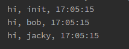

在开发过程中，经常遇到需要并发处理一些事务或不想等待程序执行立马得到返回值，此时便可异步去处理
### 同步执行
首先来看看同步执行一个方法时，程序会按照顺序一次执行完成才会执行下一次，故我们在打印结果时可以看到，每隔1秒打印了一次
```python
# coding:utf-8
import time


def hello(name):
    time.sleep(1)
    print('hi, %s, %s' % (name, time.strftime('%X')))


def main():
    names = ['jacky', 'bob', 'init']
    for i in names:
        hello(i)


if __name__ == '__main__':
    main()
```

### 异步执行
通过以下操作，可以看到执行时间为同一秒，即完成了一次简单的异步操作
```python
# coding:utf-8
import time
import asyncio


# 定义异步函数
async def hello(names):
    await asyncio.sleep(1)
    print('hi, %s, %s' % (names, time.strftime('%X')))


def main():
    names = ['jacky', 'bob', 'init']
    # 将方法添加进事件循环
    loop = asyncio.get_event_loop()
    tasks = [hello(i) for i in names]
    # 阻塞调用，直到协程运行结束才返回。参数是future，传入协程对象时内部会自动变为future
    loop.run_until_complete(asyncio.wait(tasks))
    loop.close()


if __name__ == '__main__':
    main()
```




异步IO的asyncio库使用事件循环驱动的协程实现并发。用户可主动控制程序，在认为耗时IO处添加await（yield from）。在asyncio库中，协程使用@asyncio.coroutine装饰，使用yield from来驱动，在python3.5中作了如下更改：
```python
@asyncio.coroutine -> async
yield from -> await
```
Python3.8之后 @asyncio.coroutine 装饰器就会被移除，推荐使用async & await 关键字实现协程代码。

