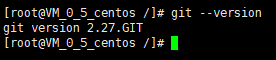

## 什么是 Hexo？
Hexo 是一个快速、简洁且高效的博客框架。Hexo 使用 Markdown（或其他渲染引擎）解析文章，在几秒内，即可利用靓丽的主题生成静态网页。基于Node.js的静态博客框架，依赖少易于安装使用，可以方便的生成静态网页托管在GitHub和Coding上，是搭建博客的首选框架。

## 环境

### 一、安装Git、Nodejs、Hexo

#### 1.安装Git
Windows：
可通过[Git官网](https://git-scm.com/download/win)自行下载安装，一路Next，记住将路径加到环境变量中。


Linux：
##### 1.1 检查git是否已经安装
``` bash
git --version
```
如果出现以下提示直接下一步：
``` bash
[root@VM_0_5_centos /]# git --version
git version 2.27.GIT
```

##### 1.2 安装Git
如果出现的提示是Not Find那就进行以下命令进行安装吧
``` bash
yum -y install git
```
##### 1.3 检查Git版本
安装完成后输入命令查看Git版本：
``` bash
[root@VM_0_5_centos /]# git --version
git version 2.27.GIT
```


提示：yum安装git被安装在/usr/libexec/git-core目录下


#### 2.安装Nodejs
Windows：
##### 2.1 [Node.js 官方网站下载](https://nodejs.org/en/)，并且选择操作系统对应的包
##### 2.2 下载完成后一路next即可

提示：切记，将exe文件路径添加至环境变量中


Linux：
##### 2.1 [Node.js 官方网站下载](https://nodejs.org/en/)，并且选择操作系统对应的包
##### 2.2 将安装包上传到指定位置，并解压
``` bash
tar -xvf node-v10.6.0-linux-x64.tar.xz
```
##### 2.3 通过建立软连接变为全局
``` bash
ln -s /usr/local/application/nodejs/bin/npm /usr/local/bin/
ln -s /usr/local/application/nodejs/bin/node /usr/local/bin/
```
##### 2.4 检查是否安装成功
``` bash
node-v
```
#### 3.安装Hexo
##### 3.1 安装Hexo
当Git以及node.js安装完毕后，即可开始安装Hexo，首先先创建一个文件夹(用于存放code)，使用 git bash 进入该文件夹，输入命令：
``` bash
npm install -g hexo-cli
```
##### 3.2 查看Hexo版本
安装完成后，查看版本
``` bash
hexo -v
```
当看到打印出来的版本号后，说明以及安装完成

### 二、生成Hexo
#### 初始化Hexo
``` bash
hexo init myblog //文件夹名称
```
#### 安装依赖包
``` bash
npm install
```
当新建完成后，将会出现以下文件夹
##### 1.node_modules：依赖包
##### 2.public：生成的页面
##### 3.scaffolds：文章模板
##### 4.source：文章
##### 5.themes：主题
##### 6._config.yml：配置文件

### 三、启动Hexo项目
#### 启动
##### 1.生成静态文件
``` bash
hexo generate
```
也可以简写为
``` bash
hexo g
```
##### 2.生成静态文件
``` bash
hexo server
```
也可以简写为
``` bash
hexo s
```

完成以上操作后，根据提示在浏览器输入localhost:4000即可打开看到你的博客啦~



### 三、部署至GitHub中的
#### 1.GitHub创建仓库
在GitHub中创建一个自己的仓库
##### 1.1 生成SSH并添加至GitHub中
1.配置Git相关信息
``` bash
git config --global user.name "你的用户名"
git config --global user.email "你的email"
```
2.创建SSH，输入命令后一路回车
``` bash
ssh-keygen -t rsa -C "youremail"
```
创建完成后会在本地生成一个文件夹，在文件夹中找到id_rsa.pub，复制出来
``` bash
C:\Users\think\.ssh //路径
```

id_rsa是当前计算机的私人秘钥，id_rsa.pub是公共秘钥。把公钥放在GitHub上，这样GitHub就会根据公钥去匹配你的私钥，当匹配上了后，就能够通过git上传你的文件到GitHub。


然后在GitHub的setting中，找到SSH keys的设置选项，点击New SSH key 把刚刚复制的信息放进去

##### 1.2 在GitHub创建仓库
点击右上角+号，选择new repository，在Repository name中输入：
``` bash
你的用户名.github.io
```

点击Create repository即可完成项目创建

#### 2.将Hexo部署到GitHub Pages中
##### 2.1 修改配置文件
1.打开根目录下的_config.yml文件，拉到最后
``` bash
deploy:
    type: git
    repository: https://github.com/你的用户名/你的用户名.github.io.git
    branch: master //分支名称
```
##### 2.2 安装上传渲染插件
需要安装deploy-git，这样才可以部署到GitHub中
``` bash
npm install hexo-deployer-git --save
```
##### 2.3 部署
输入完整命令进行部署
``` bash
hexo clean
hexo generate
hexo deploy
```
也可以输入简化命令
``` bash
hexo clean //清除之前生成的文件，也可不加
hexo g //生成静态文件
hexo d //部署
```
##### 2.4 GitHub中配置GitHub Pages

进入刚刚创建的仓库中，打开Setting-Pages，选择需要部署的分支以及读取的根目录，点击save后，页面将会将部署后可访问的域名展示出来，直接访问即可


